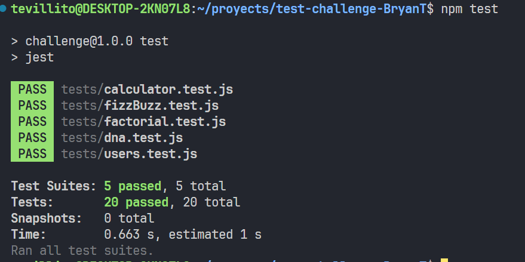
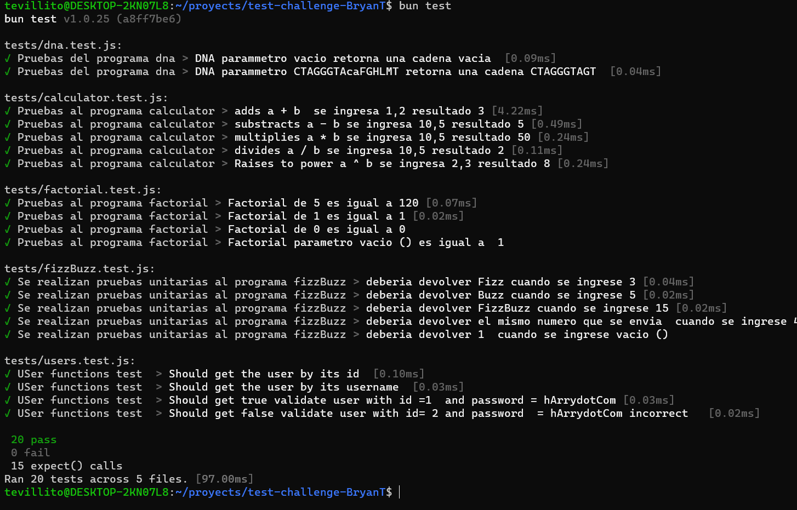

# Jest Challenge

## Overview

### Purpose

- This is a concise exercise designed to enhance your skills in unit testing using Jest.
- The tasks involve refactoring and optimizing code.

### Technical Requirements

- **Primary Tool:** Jest
- **Additional Requirements:** Dependencies related to Jest

### Key Components

1. **Files for Testing:**

   - `calculator.js` and `users.js`: These files contain the primary methods you will be testing.
   - `tests` directory: Here, you are expected to write your test cases.
   - `data.js`: This file includes an array of user data for manipulation in tests.
   - `index.js`: This file is not relevant to the exercise and can be ignored.

2. **Specific Testing Tasks:**

   a. **FizzBuzz Function:**

   - Develop a function that accepts a number and evaluates the following conditions:
     - If divisible by 3, return 'Fizz'.
     - If divisible by 5, return 'Buzz'.
     - If divisible by both 3 and 5, return 'FizzBuzz'.
     - Otherwise, return the original number.

   b. **DNA String Filter:**

   - Create a function to process a DNA string (e.g., 'CTAGGGTA').
   - The function should remove any non-canonical DNA bases (anything other than 'C', 'T', 'A', 'G').
   - The function should be case sensitive (keep 'C' but remove 'c').
   - If the DNA string is empty, return an empty string.

   c. **Factorial Calculation:**

   - Implement a function to calculate the factorial of a number using recursion.

## npm test resultados

## bun test resultados

